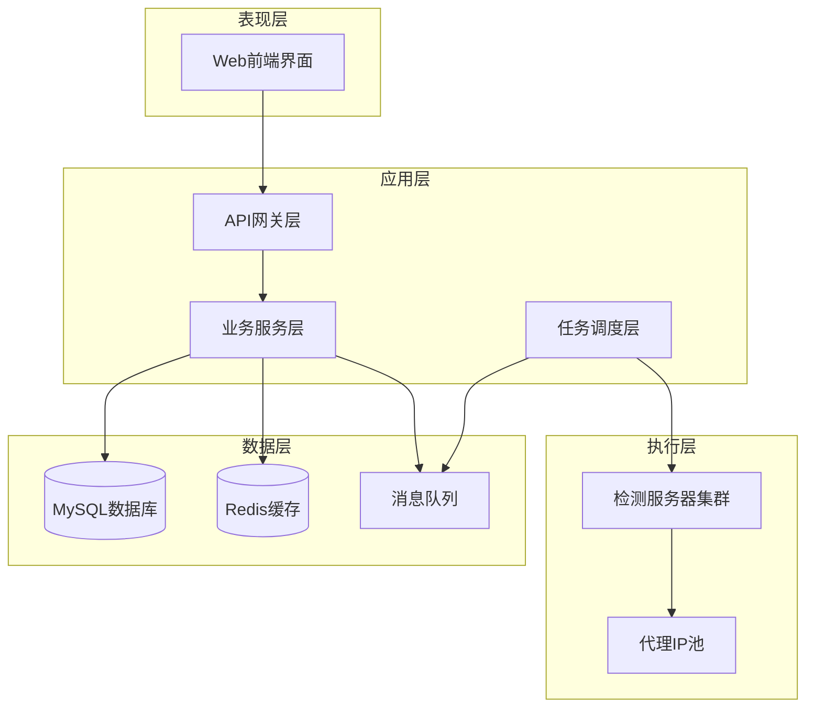
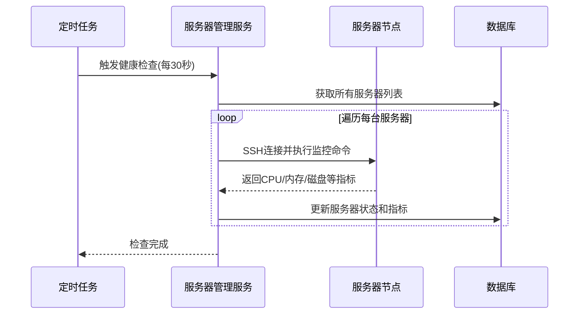
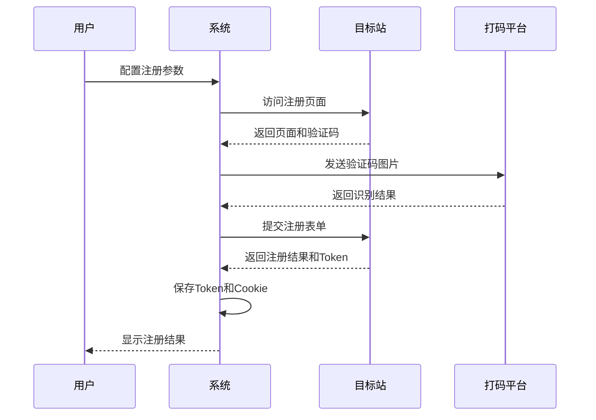
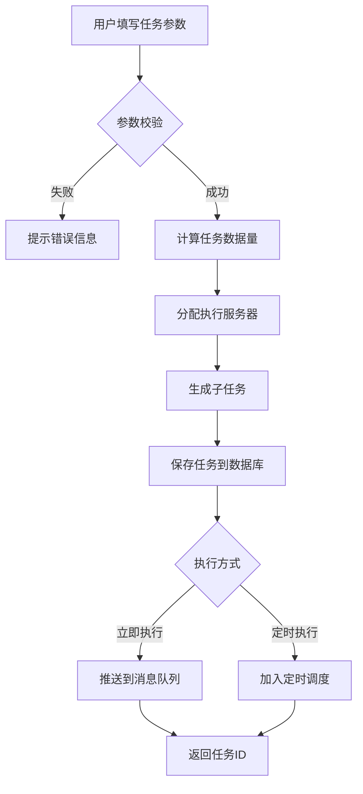
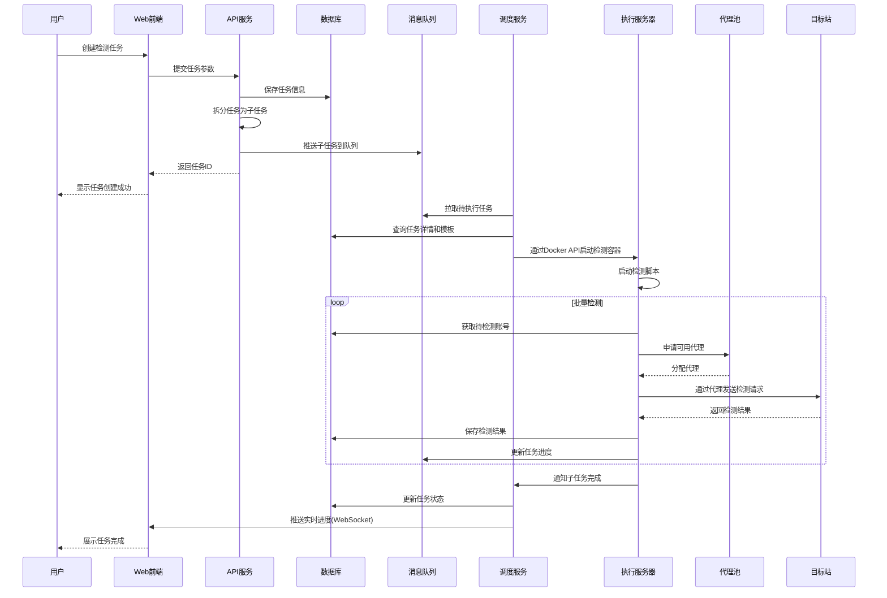
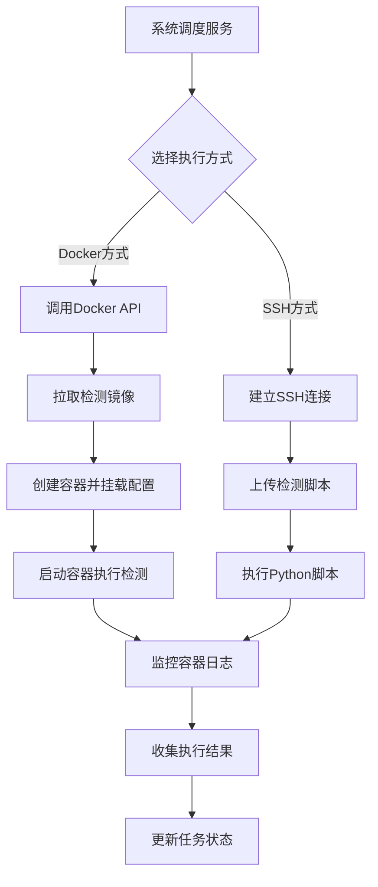
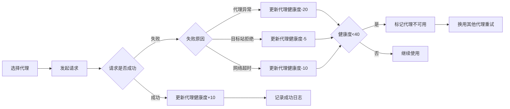
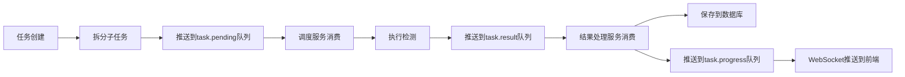
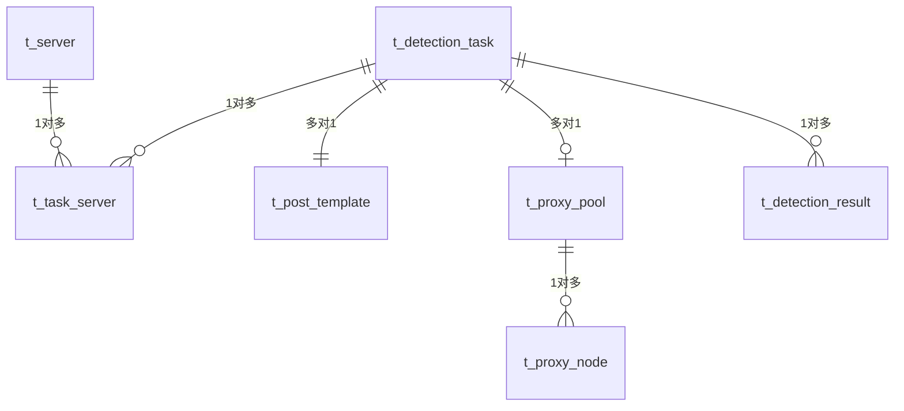

# 自动化数据检测平台 - 系统架构设计

## 1. 系统概述

### 1.1 系统定位
自动化数据检测平台是一个分布式任务调度与执行系统,用于批量检测账号在目标网站的注册状态。系统通过Web界面统一管理多台服务器资源、代理IP池和检测任务,实现高并发、可扩展的自动化检测能力。

### 1.2 核心价值
- 统一管理多台检测服务器,提升资源利用率
- 集中配置代理IP池,降低被目标站封禁风险
- 自动化生成检测脚本,减少人工配置成本
- 实时监控任务进度,快速定位异常情况
- 历史数据留存,支持数据分析与追溯

### 1.3 技术选型概览

| 技术层次 | 技术选型 | 选型理由 |
|---------|---------|---------|
| 前端框架 | Vue 3 + Element Plus | 组件化开发,丰富的UI组件库 |
| 后端框架 | Spring Boot | 快速开发,生态成熟 |
| 数据库 | MySQL 8.0 | 事务支持,关系型数据存储 |
| 缓存层 | Redis | 任务状态缓存,会话管理 |
| 容器化 | Docker + Docker Compose | 简化部署,环境隔离 |
| 消息队列 | RabbitMQ | 任务分发,削峰填谷 |
| 远程控制 | SSH + Docker API | 服务器管理,容器编排 |

## 2. 系统架构设计

### 2.1 总体架构

系统采用三层架构模式:



### 2.2 核心架构原则

| 原则 | 具体措施 |
|-----|---------|
| 高可用性 | 任务失败自动重试,服务器状态实时监控 |
| 可扩展性 | 支持动态添加检测服务器,横向扩展 |
| 安全性 | 服务器连接密钥加密存储,代理IP鉴权 |
| 性能优化 | Redis缓存热点数据,异步任务处理 |
| 数据一致性 | 事务保证任务状态更新的原子性 |

## 3. 功能模块设计

### 3.1 服务器管理模块

#### 3.1.1 功能描述
管理用于执行检测任务的服务器资源,包括服务器的增删改查、状态监控、容器管理等功能。

#### 3.1.2 核心功能点
- 服务器注册:录入服务器IP、SSH端口、认证信息、Docker配置
- 状态监控:实时检测服务器CPU、内存、磁盘、网络状态
- 容器管理:查看服务器上运行的检测容器,支持启动/停止/重启
- 健康检查:定时心跳检测,自动标记离线服务器

#### 3.1.3 数据模型

| 字段名称 | 数据类型 | 说明 |
|---------|---------|------|
| 服务器ID | 主键 | 唯一标识 |
| 服务器名称 | 字符串 | 自定义名称 |
| IP地址 | 字符串 | 服务器IP |
| SSH端口 | 整数 | SSH连接端口 |
| 认证方式 | 枚举 | 密码/密钥 |
| 认证凭证 | 加密字符串 | 密码或密钥内容 |
| Docker端口 | 整数 | Docker API端口 |
| 服务器状态 | 枚举 | 在线/离线/异常 |
| CPU使用率 | 浮点数 | 当前CPU使用百分比 |
| 内存使用率 | 浮点数 | 当前内存使用百分比 |
| 最大并发数 | 整数 | 该服务器支持的最大并发任务数 |
| 当前任务数 | 整数 | 正在执行的任务数 |
| 创建时间 | 时间戳 | 服务器注册时间 |
| 最后心跳时间 | 时间戳 | 最后一次健康检查时间 |

#### 3.1.4 状态监控流程



### 3.2 代理资源池模块

#### 3.2.1 功能描述
管理用于检测任务的IP代理资源,支持多种代理类型,实现代理的动态分配与健康检查。

#### 3.2.2 核心功能点
- 代理管理:添加、编辑、删除代理节点
- 代理分组:按地区、运营商等维度组织代理池
- 可用性检测:定期验证代理连通性和匿名性
- 智能分配:根据代理健康度和使用频率分配代理
- 使用统计:记录代理使用次数、成功率、响应时间

#### 3.2.3 数据模型

**代理池表**

| 字段名称 | 数据类型 | 说明 |
|---------|---------|------|
| 代理池ID | 主键 | 唯一标识 |
| 代理池名称 | 字符串 | 自定义名称 |
| 代理类型 | 枚举 | HTTP/HTTPS/SOCKS5 |
| 描述 | 文本 | 代理池用途说明 |
| 创建时间 | 时间戳 | 创建时间 |

**代理节点表**

| 字段名称 | 数据类型 | 说明 |
|---------|---------|------|
| 代理ID | 主键 | 唯一标识 |
| 所属代理池ID | 外键 | 关联代理池 |
| 代理地址 | 字符串 | IP:端口 |
| 代理类型 | 枚举 | HTTP/HTTPS/SOCKS5 |
| 认证方式 | 枚举 | 无认证/用户名密码 |
| 用户名 | 字符串 | 认证用户名(可选) |
| 密码 | 加密字符串 | 认证密码(可选) |
| 地区 | 字符串 | 代理所在地区 |
| 运营商 | 字符串 | 网络运营商 |
| 状态 | 枚举 | 可用/不可用/检测中 |
| 健康度 | 整数 | 0-100分,根据成功率计算 |
| 使用次数 | 整数 | 累计使用次数 |
| 成功次数 | 整数 | 成功请求次数 |
| 平均响应时间 | 整数 | 毫秒 |
| 最后检测时间 | 时间戳 | 最后一次可用性检测时间 |
| 创建时间 | 时间戳 | 添加时间 |

#### 3.2.4 代理分配策略

根据以下因素动态选择代理:
1. 代理状态必须为"可用"
2. 健康度评分高于60分
3. 优先选择使用次数少的代理(负载均衡)
4. 同一目标站在短时间内避免使用相同代理(防止封禁)

### 3.3 数据中心模块

#### 3.3.1 功能描述
管理检测所需的账号数据和检测结果,提供数据的导入、查询、导出功能。

#### 3.3.2 核心功能点
- 基础数据管理:导入待检测的账号数据(邮箱/手机号等)
- 最新数据展示:显示最近完成的检测结果
- 历史数据查询:按时间范围、目标站、状态等条件查询历史记录
- 数据导出:支持导出检测结果为CSV/Excel格式
- 数据统计:按目标站汇总注册率、检测成功率等指标

#### 3.3.3 数据模型

**基础数据表**

| 字段名称 | 数据类型 | 说明 |
|---------|---------|------|
| 数据ID | 主键 | 唯一标识 |
| 账号标识 | 字符串 | 邮箱/手机号/用户名 |
| 账号类型 | 枚举 | 邮箱/手机号/用户名 |
| 数据来源 | 字符串 | 数据来源描述 |
| 导入批次 | 字符串 | 批次号 |
| 导入时间 | 时间戳 | 导入时间 |
| 备注 | 文本 | 附加信息 |

**检测结果表**

| 字段名称 | 数据类型 | 说明 |
|---------|---------|------|
| 结果ID | 主键 | 唯一标识 |
| 任务ID | 外键 | 关联检测任务 |
| 账号标识 | 字符串 | 被检测的账号 |
| 目标站 | 字符串 | 目标网站 |
| 检测状态 | 枚举 | 已注册/未注册/检测失败/账号异常/代理异常 |
| 响应时间 | 整数 | 检测耗时(毫秒) |
| 使用代理 | 字符串 | 使用的代理地址 |
| 执行服务器 | 字符串 | 执行检测的服务器IP |
| 响应详情 | JSON | 目标站返回的详细信息 |
| 错误信息 | 文本 | 失败时的错误描述 |
| 检测时间 | 时间戳 | 检测完成时间 |

#### 3.3.4 检测状态说明

| 状态 | 含义 | 场景 |
|-----|------|------|
| 已注册 | 账号已在目标站注册 | 目标站返回账号已存在 |
| 未注册 | 账号未在目标站注册 | 目标站返回账号可注册 |
| 检测失败 | 检测过程出错 | 网络超时、目标站拒绝访问 |
| 账号异常 | 账号格式错误或被封禁 | 账号不符合目标站规则 |
| 代理异常 | 代理连接失败 | 代理不可用或被封禁 |

### 3.4 业务中心模块

#### 3.4.1 网站分析功能

**功能描述**
对目标网站进行自动化分析,包括端口检测、接口识别、请求参数逆向分析,为后续的自动化检测提供技术基础。

**核心功能点**
- 端口扫描:检测目标站开放的HTTP/HTTPS端口
- 接口发现:识别注册/登录相关的API接口
- 参数解析:分析请求头、请求体的必需参数
- 加密识别:识别常见的加密算法和签名方式
- 分析报告:生成JSON格式的逆向分析结果

**分析流程**


**输出数据结构**

| 字段 | 说明 |
|-----|------|
| 目标站域名 | 网站主域名 |
| 检测接口URL | 用于检测注册状态的接口地址 |
| 请求方法 | GET/POST |
| 必需请求头 | 如User-Agent、Referer、Authorization等 |
| 必需参数 | 账号字段名、其他必需参数 |
| 加密参数 | 需要加密或签名的参数及算法 |
| 成功响应特征 | 判断已注册的响应字段和值 |
| 失败响应特征 | 判断未注册的响应字段和值 |

#### 3.4.2 自动化注册功能

**功能描述**
模拟用户在目标站完成注册流程,并提取注册成功后的Token/Cookie等认证凭证,用于后续的检测验证。

**核心功能点**
- 注册流程模拟:自动填写注册表单并提交
- 验证码处理:集成第三方打码平台或使用AI识别
- Token提取:从响应或Cookie中提取认证凭证
- 流程录制:记录完整的注册流程供后续复用
- 成功率统计:记录注册成功率和失败原因

**注册流程**



**输出数据结构**

| 字段 | 说明 |
|-----|------|
| 目标站 | 网站标识 |
| 注册账号 | 成功注册的账号 |
| Token | 认证令牌 |
| Cookie | 会话Cookie |
| 过期时间 | Token有效期 |
| 注册流程配置 | JSON格式的流程参数 |

#### 3.4.3 POST模板功能

**功能描述**
根据网站分析和自动化注册的产出,自动生成用于检测的请求模板,简化检测任务的配置工作。

**核心功能点**
- 模板自动生成:基于逆向分析结果生成请求模板
- 模板编辑:支持手动调整请求参数和逻辑
- 模板测试:在线测试模板的有效性
- 模板版本管理:支持同一目标站的多个模板版本
- 模板复用:一个模板可被多个检测任务使用

**模板数据结构**

| 字段名称 | 数据类型 | 说明 |
|---------|---------|------|
| 模板ID | 主键 | 唯一标识 |
| 模板名称 | 字符串 | 自定义名称 |
| 目标站 | 字符串 | 适用的目标网站 |
| 请求URL | 字符串 | 接口地址 |
| 请求方法 | 枚举 | GET/POST |
| 请求头模板 | JSON | 请求头键值对 |
| 请求体模板 | JSON | 请求体参数,支持变量占位符 |
| 成功判断规则 | JSON | 响应字段匹配规则 |
| 失败判断规则 | JSON | 响应字段匹配规则 |
| 是否启用代理 | 布尔 | 是否使用代理IP |
| 超时时间 | 整数 | 请求超时时间(秒) |
| 重试次数 | 整数 | 失败后重试次数 |
| 版本号 | 字符串 | 模板版本 |
| 创建时间 | 时间戳 | 创建时间 |
| 更新时间 | 时间戳 | 最后修改时间 |

**变量占位符说明**

模板中支持使用占位符,在执行时动态替换:
- `{{account}}`:待检测的账号
- `{{timestamp}}`:当前时间戳
- `{{random}}`:随机字符串
- `{{proxy_ip}}`:使用的代理IP

### 3.5 检测任务模块

#### 3.5.1 新建检测功能

**功能描述**
创建新的批量检测任务,配置任务的执行参数,包括数据源、代理池、执行服务器等。

**配置参数**

| 参数名称 | 说明 | 是否必需 |
|---------|------|---------|
| 任务名称 | 任务的自定义名称 | 是 |
| 目标站 | 要检测的目标网站 | 是 |
| POST模板 | 选择已配置的请求模板 | 是 |
| 数据源 | 选择待检测的账号数据 | 是 |
| 代理池 | 选择使用的代理池 | 否 |
| 执行服务器 | 选择执行任务的服务器(可多选) | 是 |
| 并发数 | 每台服务器的并发线程数 | 是 |
| 失败重试次数 | 检测失败时的重试次数 | 否 |
| 执行优先级 | 任务优先级(高/中/低) | 否 |
| 计划执行时间 | 立即执行或定时执行 | 是 |

**任务创建流程**



#### 3.5.2 任务列表功能

**功能描述**
展示所有检测任务的状态,支持启动、暂停、停止任务,实时监控任务执行进度。

**任务状态定义**

| 状态 | 说明 | 可执行操作 |
|-----|------|-----------|
| 待执行 | 任务已创建,等待执行 | 启动、编辑、删除 |
| 执行中 | 任务正在执行 | 暂停、停止、查看详情 |
| 已暂停 | 任务被手动暂停 | 继续、停止、删除 |
| 已完成 | 任务执行完毕 | 查看详情、导出结果、删除 |
| 失败 | 任务执行失败 | 重新执行、查看日志、删除 |
| 已停止 | 任务被手动停止 | 重新执行、删除 |

**任务数据模型**

| 字段名称 | 数据类型 | 说明 |
|---------|---------|------|
| 任务ID | 主键 | 唯一标识 |
| 任务名称 | 字符串 | 自定义名称 |
| 目标站 | 字符串 | 目标网站 |
| 模板ID | 外键 | 关联POST模板 |
| 代理池ID | 外键 | 关联代理池(可选) |
| 任务状态 | 枚举 | 当前状态 |
| 优先级 | 枚举 | 高/中/低 |
| 总数据量 | 整数 | 待检测账号总数 |
| 已完成数量 | 整数 | 已检测的账号数 |
| 成功数量 | 整数 | 检测成功的数量 |
| 失败数量 | 整数 | 检测失败的数量 |
| 并发数 | 整数 | 并发线程数 |
| 执行进度 | 浮点数 | 完成百分比 |
| 创建时间 | 时间戳 | 任务创建时间 |
| 开始时间 | 时间戳 | 任务开始执行时间 |
| 结束时间 | 时间戳 | 任务完成时间 |
| 预计剩余时间 | 整数 | 根据当前速度预估(秒) |

**任务与服务器关联表**

| 字段名称 | 数据类型 | 说明 |
|---------|---------|------|
| 关联ID | 主键 | 唯一标识 |
| 任务ID | 外键 | 关联任务 |
| 服务器ID | 外键 | 关联服务器 |
| 分配数据量 | 整数 | 该服务器负责的数据量 |
| 已完成数量 | 整数 | 该服务器已完成数量 |
| 执行状态 | 枚举 | 执行中/已完成/失败 |

**实时监控展示内容**

- 任务执行进度条
- 当前执行速度(条/秒)
- 已执行时间 / 预计剩余时间
- 各服务器执行情况
- 实时成功率和失败率
- 最近10条检测结果日志

#### 3.5.3 已完成任务功能

**功能描述**
查看历史完成的任务详情,包括执行统计、结果分布、日志查询等。

**统计维度**

| 统计项 | 说明 |
|-------|------|
| 执行总时长 | 任务从开始到结束的耗时 |
| 平均检测速度 | 总数据量 / 总时长 |
| 注册率 | 已注册账号占比 |
| 检测成功率 | 成功检测的占比 |
| 服务器使用情况 | 各服务器的负载分布 |
| 代理使用情况 | 各代理的使用次数和成功率 |
| 异常分布 | 各类失败原因的占比 |

**结果导出格式**

支持导出为CSV或Excel,包含以下字段:
- 账号标识
- 检测状态
- 检测时间
- 使用代理
- 执行服务器
- 响应时间
- 错误信息(如有)

## 4. 系统交互流程

### 4.1 任务执行完整流程



### 4.2 服务器控制流程



### 4.3 代理容错机制



## 5. 前端架构设计

### 5.1 页面结构

```
自动化数据检测平台
├── 登录页
└── 主界面
    ├── 顶部导航栏
    │   ├── 系统Logo
    │   ├── 用户信息
    │   └── 退出登录
    ├── 侧边菜单栏
    │   ├── 仪表盘
    │   ├── 服务器管理
    │   ├── 代理资源池
    │   ├── 数据中心
    │   │   ├── 基础数据
    │   │   ├── 最新数据
    │   │   └── 历史数据
    │   ├── 业务中心
    │   │   ├── 网站分析
    │   │   ├── 自动化注册
    │   │   └── POST模板
    │   └── 检测任务
    │       ├── 新建检测
    │       ├── 任务列表
    │       └── 已完成任务
    └── 主内容区
```

### 5.2 核心页面设计

#### 5.2.1 仪表盘页面

**展示内容**
- 系统概览:在线服务器数、可用代理数、今日任务数、总检测量
- 实时监控:当前执行中的任务列表及进度
- 资源使用:服务器CPU/内存使用率图表
- 数据统计:近7天检测趋势图、成功率趋势图
- 快捷入口:快速创建任务、添加服务器、导入数据

#### 5.2.2 服务器管理页面

**页面布局**
- 顶部操作区:添加服务器按钮、批量操作按钮
- 服务器列表表格:
  - 列:服务器名称、IP地址、状态、CPU使用率、内存使用率、当前任务数、操作
  - 操作按钮:编辑、测试连接、查看容器、删除
- 服务器详情抽屉:点击服务器展开详细信息

**状态可视化**
- 在线:绿色指示灯
- 离线:红色指示灯
- 异常:黄色指示灯

#### 5.2.3 代理资源池页面

**页面布局**
- 左侧:代理池列表(树形结构)
- 右侧:选中代理池的代理节点列表
- 顶部操作区:添加代理池、添加代理、批量导入、健康检查
- 代理列表表格:
  - 列:代理地址、类型、地区、状态、健康度、使用次数、成功率、操作
  - 操作按钮:编辑、测试、删除

**健康度可视化**
- 80-100分:绿色进度条
- 60-79分:黄色进度条
- 0-59分:红色进度条

#### 5.2.4 新建检测页面

**表单步骤**
1. 基础配置:任务名称、目标站、POST模板
2. 数据源选择:选择待检测的账号数据
3. 资源配置:代理池、执行服务器、并发数
4. 高级选项:重试次数、优先级、执行时间
5. 确认提交:预览配置并提交

**表单验证**
- 任务名称不能为空
- 必须选择POST模板
- 必须选择至少一台服务器
- 并发数必须在1-100之间

#### 5.2.5 任务列表页面

**页面布局**
- 顶部筛选区:状态筛选、时间范围、关键字搜索
- 任务列表表格:
  - 列:任务名称、目标站、状态、进度、成功率、创建时间、操作
  - 操作按钮:启动/暂停/停止、查看详情、删除
- 任务详情模态框:
  - 实时进度条
  - 执行统计
  - 服务器分布
  - 实时日志

**实时更新机制**
- 使用WebSocket实现任务进度的实时推送
- 每秒更新一次进度百分比和速度
- 新增检测结果实时滚动显示

### 5.3 技术实现要点

#### 5.3.1 状态管理
使用Pinia进行全局状态管理,主要状态包括:
- 用户信息状态
- 服务器列表状态
- 代理池状态
- 任务列表状态
- WebSocket连接状态

#### 5.3.2 路由设计
采用Vue Router进行路由管理,主要路由:
- `/login`:登录页
- `/dashboard`:仪表盘
- `/server`:服务器管理
- `/proxy`:代理资源池
- `/data/base`:基础数据
- `/data/latest`:最新数据
- `/data/history`:历史数据
- `/business/analysis`:网站分析
- `/business/register`:自动化注册
- `/business/template`:POST模板
- `/task/create`:新建检测
- `/task/list`:任务列表
- `/task/completed`:已完成任务

#### 5.3.3 组件设计
**公共组件**
- ServerStatusBadge:服务器状态徽章
- ProxyHealthBar:代理健康度进度条
- TaskProgressBar:任务进度条
- RealTimeLog:实时日志滚动组件
- DataExportDialog:数据导出对话框

**图表组件**
使用ECharts实现数据可视化:
- 折线图:检测趋势、成功率趋势
- 饼图:状态分布、代理使用分布
- 仪表盘:服务器资源使用率

## 6. 后端架构设计

### 6.1 技术栈

| 组件 | 技术选型 | 版本 |
|-----|---------|------|
| 开发语言 | Java | 17 |
| 开发框架 | Spring Boot | 3.2.x |
| ORM框架 | MyBatis Plus | 3.5.x |
| 数据库 | MySQL | 8.0 |
| 缓存 | Redis | 7.0 |
| 消息队列 | RabbitMQ | 3.12.x |
| 任务调度 | Spring Task + Quartz | - |
| WebSocket | Spring WebSocket | - |
| SSH客户端 | JSch | 0.1.55 |
| Docker客户端 | docker-java | 3.3.x |
| HTTP客户端 | OkHttp | 4.x |

### 6.2 分层架构

```
后端项目结构
├── controller层:接收HTTP请求,参数校验
├── service层:业务逻辑处理
├── manager层:通用业务封装(如缓存、远程调用)
├── dao层:数据库访问
├── entity层:数据库实体
├── dto层:数据传输对象
├── vo层:视图对象
├── converter层:对象转换
├── config层:配置类
├── common层:公共组件
│   ├── exception:异常定义
│   ├── utils:工具类
│   └── constants:常量定义
└── scheduler层:定时任务
```

### 6.3 核心服务模块

#### 6.3.1 服务器管理服务(ServerManageService)

**主要职责**
- 服务器的增删改查
- SSH连接管理和连接池维护
- 服务器状态监控(CPU、内存、磁盘)
- Docker容器管理(启动、停止、查看日志)

**核心方法**

| 方法名 | 功能描述 | 输入参数 | 返回结果 |
|-------|---------|---------|---------|
| addServer | 添加服务器 | 服务器配置信息 | 服务器ID |
| testConnection | 测试服务器连接 | 服务器ID | 连接状态 |
| monitorServer | 监控服务器状态 | 服务器ID | 监控指标 |
| listContainers | 查看容器列表 | 服务器ID | 容器列表 |
| startContainer | 启动容器 | 服务器ID、容器配置 | 容器ID |
| stopContainer | 停止容器 | 服务器ID、容器ID | 是否成功 |

#### 6.3.2 代理管理服务(ProxyManageService)

**主要职责**
- 代理池和代理节点的CRUD
- 代理健康检查和评分
- 代理动态分配和负载均衡
- 代理使用统计

**核心方法**

| 方法名 | 功能描述 | 输入参数 | 返回结果 |
|-------|---------|---------|---------|
| allocateProxy | 分配可用代理 | 代理池ID、目标站 | 代理信息 |
| checkProxyHealth | 检测代理健康度 | 代理ID | 健康度分数 |
| updateProxyStats | 更新代理统计 | 代理ID、使用结果 | 无 |
| batchImportProxy | 批量导入代理 | 代理列表文件 | 导入结果 |

#### 6.3.3 数据管理服务(DataManageService)

**主要职责**
- 基础数据的导入、导出
- 检测结果的查询、统计
- 数据去重和清洗

**核心方法**

| 方法名 | 功能描述 | 输入参数 | 返回结果 |
|-------|---------|---------|---------|
| importBaseData | 导入基础数据 | 文件、数据类型 | 导入统计 |
| queryLatestResults | 查询最新结果 | 分页参数 | 结果列表 |
| queryHistoryResults | 查询历史结果 | 查询条件 | 结果列表 |
| exportResults | 导出检测结果 | 任务ID、导出格式 | 文件路径 |
| statisticsResults | 统计检测结果 | 任务ID | 统计数据 |

#### 6.3.4 模板管理服务(TemplateManageService)

**主要职责**
- POST模板的CRUD
- 模板有效性测试
- 模板版本管理

**核心方法**

| 方法名 | 功能描述 | 输入参数 | 返回结果 |
|-------|---------|---------|---------|
| createTemplate | 创建模板 | 模板配置 | 模板ID |
| testTemplate | 测试模板 | 模板ID、测试账号 | 测试结果 |
| autoGenerateTemplate | 自动生成模板 | 分析报告 | 模板配置 |

#### 6.3.5 任务管理服务(TaskManageService)

**主要职责**
- 任务的创建、执行、暂停、停止
- 任务拆分和分配
- 任务进度监控
- 任务结果汇总

**核心方法**

| 方法名 | 功能描述 | 输入参数 | 返回结果 |
|-------|---------|---------|---------|
| createTask | 创建检测任务 | 任务配置 | 任务ID |
| startTask | 启动任务 | 任务ID | 是否成功 |
| pauseTask | 暂停任务 | 任务ID | 是否成功 |
| stopTask | 停止任务 | 任务ID | 是否成功 |
| splitTask | 拆分任务 | 任务ID | 子任务列表 |
| queryTaskProgress | 查询任务进度 | 任务ID | 进度信息 |

#### 6.3.6 任务调度服务(TaskSchedulerService)

**主要职责**
- 从消息队列拉取待执行任务
- 调用服务器执行检测
- 收集执行结果并保存
- 任务失败重试

**核心方法**

| 方法名 | 功能描述 | 输入参数 | 返回结果 |
|-------|---------|---------|---------|
| scheduleTask | 调度任务执行 | 子任务信息 | 无 |
| executeDetection | 执行检测 | 检测配置、账号 | 检测结果 |
| retryFailedTask | 重试失败任务 | 任务ID | 是否成功 |

### 6.4 消息队列设计

#### 6.4.1 队列定义

| 队列名称 | 用途 | 消息格式 |
|---------|------|---------|
| task.pending | 待执行任务队列 | 子任务ID、任务配置 |
| task.result | 检测结果队列 | 账号、检测状态、详情 |
| task.progress | 任务进度队列 | 任务ID、进度百分比 |
| server.monitor | 服务器监控队列 | 服务器ID、监控指标 |

#### 6.4.2 消息流转



### 6.5 缓存设计

#### 6.5.1 缓存策略

| 缓存Key | 缓存内容 | 过期时间 | 更新策略 |
|--------|---------|---------|---------|
| server:status:{id} | 服务器状态信息 | 60秒 | 定时更新 |
| proxy:pool:{id} | 代理池可用代理列表 | 300秒 | 代理变更时清除 |
| task:progress:{id} | 任务执行进度 | 任务完成后1小时 | 实时更新 |
| template:{id} | POST模板配置 | 永久 | 模板修改时清除 |
| user:session:{token} | 用户会话信息 | 2小时 | 用户登出时清除 |

#### 6.5.2 缓存穿透防护
对于不存在的数据,缓存空值并设置较短过期时间(60秒),避免频繁查询数据库。

### 6.6 定时任务设计

| 任务名称 | 执行频率 | 功能描述 |
|---------|---------|---------|
| 服务器健康检查 | 每30秒 | 检测所有服务器状态并更新缓存 |
| 代理健康检查 | 每5分钟 | 批量检测代理可用性并更新健康度 |
| 任务状态同步 | 每10秒 | 同步任务执行进度到数据库 |
| 过期数据清理 | 每天凌晨2点 | 清理30天前的检测结果数据 |
| 任务超时检测 | 每1分钟 | 检测超时未完成的任务并标记异常 |

## 7. 数据库设计

### 7.1 数据库选型理由
选择MySQL作为主数据库,原因如下:
- 支持ACID事务,保证任务状态更新的一致性
- 关系型结构适合多表关联查询(如任务-服务器-代理)
- 成熟的索引机制,支持高效的分页和条件查询
- 丰富的运维工具和监控方案

### 7.2 核心表设计

#### 7.2.1 服务器表(t_server)

```
表说明:存储检测服务器的连接信息和状态
索引:server_status_idx(status, last_heartbeat_time)
```

| 字段 | 类型 | 约束 | 说明 |
|-----|------|------|------|
| id | BIGINT | 主键,自增 | 服务器ID |
| server_name | VARCHAR(100) | NOT NULL | 服务器名称 |
| ip_address | VARCHAR(50) | NOT NULL | IP地址 |
| ssh_port | INT | NOT NULL | SSH端口 |
| auth_type | TINYINT | NOT NULL | 认证方式:1密码,2密钥 |
| auth_credential | TEXT | NOT NULL | 加密后的凭证 |
| docker_port | INT | NULL | Docker API端口 |
| status | TINYINT | NOT NULL | 状态:1在线,2离线,3异常 |
| cpu_usage | DECIMAL(5,2) | NULL | CPU使用率 |
| memory_usage | DECIMAL(5,2) | NULL | 内存使用率 |
| max_concurrent | INT | DEFAULT 10 | 最大并发数 |
| current_tasks | INT | DEFAULT 0 | 当前任务数 |
| create_time | DATETIME | NOT NULL | 创建时间 |
| last_heartbeat_time | DATETIME | NULL | 最后心跳时间 |

#### 7.2.2 代理池表(t_proxy_pool)

```
表说明:代理池分组管理
```

| 字段 | 类型 | 约束 | 说明 |
|-----|------|------|------|
| id | BIGINT | 主键,自增 | 代理池ID |
| pool_name | VARCHAR(100) | NOT NULL | 代理池名称 |
| proxy_type | TINYINT | NOT NULL | 代理类型:1HTTP,2HTTPS,3SOCKS5 |
| description | TEXT | NULL | 描述 |
| create_time | DATETIME | NOT NULL | 创建时间 |

#### 7.2.3 代理节点表(t_proxy_node)

```
表说明:存储代理IP节点
索引:pool_status_idx(pool_id, status, health_score)
```

| 字段 | 类型 | 约束 | 说明 |
|-----|------|------|------|
| id | BIGINT | 主键,自增 | 代理ID |
| pool_id | BIGINT | NOT NULL | 所属代理池ID |
| proxy_address | VARCHAR(100) | NOT NULL | 代理地址(IP:端口) |
| proxy_type | TINYINT | NOT NULL | 代理类型 |
| auth_type | TINYINT | DEFAULT 0 | 认证方式:0无,1用户名密码 |
| username | VARCHAR(100) | NULL | 用户名 |
| password | VARCHAR(255) | NULL | 加密密码 |
| region | VARCHAR(50) | NULL | 地区 |
| isp | VARCHAR(50) | NULL | 运营商 |
| status | TINYINT | NOT NULL | 状态:1可用,2不可用,3检测中 |
| health_score | INT | DEFAULT 100 | 健康度0-100 |
| use_count | BIGINT | DEFAULT 0 | 使用次数 |
| success_count | BIGINT | DEFAULT 0 | 成功次数 |
| avg_response_time | INT | NULL | 平均响应时间(毫秒) |
| last_check_time | DATETIME | NULL | 最后检测时间 |
| create_time | DATETIME | NOT NULL | 创建时间 |

#### 7.2.4 基础数据表(t_base_data)

```
表说明:待检测的账号数据
索引:account_type_idx(account_identifier, account_type)
```

| 字段 | 类型 | 约束 | 说明 |
|-----|------|------|------|
| id | BIGINT | 主键,自增 | 数据ID |
| account_identifier | VARCHAR(255) | NOT NULL | 账号标识 |
| account_type | TINYINT | NOT NULL | 账号类型:1邮箱,2手机,3用户名 |
| data_source | VARCHAR(100) | NULL | 数据来源 |
| import_batch | VARCHAR(50) | NULL | 导入批次 |
| import_time | DATETIME | NOT NULL | 导入时间 |
| remark | TEXT | NULL | 备注 |

#### 7.2.5 POST模板表(t_post_template)

```
表说明:检测请求模板
索引:target_site_idx(target_site)
```

| 字段 | 类型 | 约束 | 说明 |
|-----|------|------|------|
| id | BIGINT | 主键,自增 | 模板ID |
| template_name | VARCHAR(100) | NOT NULL | 模板名称 |
| target_site | VARCHAR(255) | NOT NULL | 目标站 |
| request_url | VARCHAR(500) | NOT NULL | 请求URL |
| request_method | VARCHAR(10) | NOT NULL | 请求方法 |
| request_headers | JSON | NULL | 请求头模板 |
| request_body | JSON | NULL | 请求体模板 |
| success_rule | JSON | NOT NULL | 成功判断规则 |
| fail_rule | JSON | NOT NULL | 失败判断规则 |
| enable_proxy | TINYINT | DEFAULT 1 | 是否启用代理 |
| timeout_seconds | INT | DEFAULT 30 | 超时时间 |
| retry_count | INT | DEFAULT 3 | 重试次数 |
| version | VARCHAR(20) | NULL | 版本号 |
| create_time | DATETIME | NOT NULL | 创建时间 |
| update_time | DATETIME | NOT NULL | 更新时间 |

#### 7.2.6 检测任务表(t_detection_task)

```
表说明:检测任务主表
索引:status_create_time_idx(status, create_time)
```

| 字段 | 类型 | 约束 | 说明 |
|-----|------|------|------|
| id | BIGINT | 主键,自增 | 任务ID |
| task_name | VARCHAR(200) | NOT NULL | 任务名称 |
| target_site | VARCHAR(255) | NOT NULL | 目标站 |
| template_id | BIGINT | NOT NULL | 模板ID |
| proxy_pool_id | BIGINT | NULL | 代理池ID |
| task_status | TINYINT | NOT NULL | 状态:1待执行,2执行中,3已暂停,4已完成,5失败,6已停止 |
| priority | TINYINT | DEFAULT 2 | 优先级:1高,2中,3低 |
| total_count | BIGINT | NOT NULL | 总数据量 |
| completed_count | BIGINT | DEFAULT 0 | 已完成数量 |
| success_count | BIGINT | DEFAULT 0 | 成功数量 |
| fail_count | BIGINT | DEFAULT 0 | 失败数量 |
| concurrent_num | INT | NOT NULL | 并发数 |
| progress_percent | DECIMAL(5,2) | DEFAULT 0 | 进度百分比 |
| create_time | DATETIME | NOT NULL | 创建时间 |
| start_time | DATETIME | NULL | 开始时间 |
| end_time | DATETIME | NULL | 结束时间 |
| estimate_remaining_seconds | BIGINT | NULL | 预计剩余秒数 |

#### 7.2.7 任务服务器关联表(t_task_server)

```
表说明:任务与服务器的多对多关系
索引:task_server_idx(task_id, server_id)
```

| 字段 | 类型 | 约束 | 说明 |
|-----|------|------|------|
| id | BIGINT | 主键,自增 | 关联ID |
| task_id | BIGINT | NOT NULL | 任务ID |
| server_id | BIGINT | NOT NULL | 服务器ID |
| assigned_count | BIGINT | NOT NULL | 分配数据量 |
| completed_count | BIGINT | DEFAULT 0 | 已完成数量 |
| exec_status | TINYINT | NOT NULL | 执行状态:1执行中,2已完成,3失败 |

#### 7.2.8 检测结果表(t_detection_result)

```
表说明:检测结果详情
索引:task_id_idx(task_id), account_idx(account_identifier), detect_time_idx(detect_time)
分区策略:按月分区,每月一个分区
```

| 字段 | 类型 | 约束 | 说明 |
|-----|------|------|------|
| id | BIGINT | 主键,自增 | 结果ID |
| task_id | BIGINT | NOT NULL | 任务ID |
| account_identifier | VARCHAR(255) | NOT NULL | 账号标识 |
| target_site | VARCHAR(255) | NOT NULL | 目标站 |
| detect_status | TINYINT | NOT NULL | 状态:1已注册,2未注册,3检测失败,4账号异常,5代理异常 |
| response_time | INT | NULL | 响应时间(毫秒) |
| used_proxy | VARCHAR(100) | NULL | 使用的代理 |
| exec_server | VARCHAR(50) | NULL | 执行服务器IP |
| response_detail | JSON | NULL | 响应详情 |
| error_message | TEXT | NULL | 错误信息 |
| detect_time | DATETIME | NOT NULL | 检测时间 |

### 7.3 表关系图



### 7.4 数据归档策略

为避免结果表数据量过大影响性能,采用以下归档策略:
- 检测结果表按月分区,每月创建新分区
- 超过3个月的历史分区数据归档到冷存储(如对象存储)
- 归档后的数据仍可通过专门的历史查询接口访问
- 定期清理超过1年的归档数据

## 8. 安全设计

### 8.1 身份认证

虽然系统定位为单用户系统,但仍需实现基本的身份认证机制:

- 用户登录:用户名 + 密码登录
- Token机制:登录成功后颁发JWT Token,有效期2小时
- 自动续期:用户活跃时自动延长Token有效期
- 强制登出:修改密码后使所有Token失效

### 8.2 数据加密

敏感数据必须加密存储:

| 数据类型 | 加密方式 |
|---------|---------|
| 服务器SSH密码/密钥 | AES-256加密 |
| 代理认证密码 | AES-256加密 |
| 用户登录密码 | BCrypt哈希 |
| JWT Token | RSA签名 |

### 8.3 访问控制

- 所有API接口必须验证Token有效性
- 敏感操作(删除服务器、删除任务)需二次确认
- 记录操作日志,包括操作人、操作时间、操作内容

### 8.4 网络安全

- 前后端通信使用HTTPS加密传输
- 服务器SSH连接使用密钥认证优于密码认证
- 限制API请求频率,防止暴力破解
- 代理IP使用时校验是否被污染(如DNS泄漏)

### 8.5 异常检测

- 监控异常登录行为(如短时间多次失败)
- 监控任务异常(如成功率突然下降)
- 监控服务器异常(如CPU突然100%)
- 异常情况自动告警(邮件/webhook)

## 9. 性能优化设计

### 9.1 数据库优化

- 合理设计索引,避免全表扫描
- 结果表分区,降低单表数据量
- 读写分离,查询走从库
- 慢查询监控,定期优化

### 9.2 缓存优化

- 热点数据缓存(服务器状态、代理列表)
- 查询结果缓存(统计数据)
- 缓存预热,系统启动时加载常用数据
- 缓存击穿防护,使用互斥锁

### 9.3 并发控制

- 任务并发数可配置,避免过载
- 数据库连接池,复用连接
- 线程池管理,避免无限创建线程
- 消息队列削峰,平滑处理流量

### 9.4 异步处理

- 任务执行异步化,不阻塞主线程
- 结果保存异步化,批量写入数据库
- 监控数据异步采集,定时汇总

### 9.5 资源释放

- 及时关闭SSH连接,避免连接泄漏
- 容器执行完毕后自动销毁
- 定时清理过期缓存和临时文件

## 10. 监控与运维

### 10.1 系统监控

| 监控对象 | 监控指标 | 告警阈值 |
|---------|---------|---------|
| 应用服务 | CPU使用率、内存使用率、线程数 | CPU>80%,内存>85% |
| 数据库 | 连接数、慢查询、锁等待 | 连接数>80%,慢查询>10次/分钟 |
| Redis | 内存使用率、命中率 | 内存>90%,命中率<70% |
| RabbitMQ | 队列堆积、消费速度 | 堆积>10000,无消费超5分钟 |
| 检测服务器 | 在线状态、任务执行情况 | 离线超过3分钟 |

### 10.2 日志管理

**日志分类**
- 应用日志:业务操作、异常堆栈
- 访问日志:API请求、响应时间
- 任务日志:任务执行详情、错误信息
- 系统日志:服务器状态变更、配置修改

**日志级别**
- ERROR:系统错误,需要立即处理
- WARN:潜在问题,需要关注
- INFO:关键业务操作
- DEBUG:调试信息,生产环境关闭

**日志存储**
- 应用日志按天滚动,保留30天
- 任务日志单独存储,保留90天
- 关键日志同步到日志中心(如ELK)

### 10.3 备份策略

| 备份对象 | 备份频率 | 保留时长 |
|---------|---------|---------|
| 数据库全量备份 | 每天凌晨3点 | 30天 |
| 数据库增量备份 | 每小时 | 7天 |
| 配置文件 | 每次修改后 | 永久 |
| 代码版本 | 每次发布 | 永久 |

### 10.4 容灾方案

- 数据库主从架构,主库故障时自动切换
- 应用服务多实例部署,负载均衡
- 定期演练备份恢复流程
- 关键数据异地备份

## 11. 部署方案

### 11.1 容器化部署

系统采用Docker Compose编排,主要容器包括:

| 容器名称 | 镜像 | 端口映射 | 说明 |
|---------|------|---------|------|
| web-frontend | nginx:alpine | 80:80 | 前端静态资源 |
| api-backend | openjdk:17-slim | 8080:8080 | 后端API服务 |
| mysql | mysql:8.0 | 3306:3306 | 数据库 |
| redis | redis:7.0-alpine | 6379:6379 | 缓存 |
| rabbitmq | rabbitmq:3.12-management | 5672:5672, 15672:15672 | 消息队列 |

### 11.2 Docker Compose示例结构

系统通过Docker Compose编排,主要服务包括:
- 前端Nginx服务
- 后端Spring Boot服务
- MySQL数据库服务
- Redis缓存服务
- RabbitMQ消息队列服务

各服务通过Docker网络互联,通过环境变量配置连接信息,实现服务间解耦。

### 11.3 环境变量配置

系统运行需要的环境变量包括:

| 变量名 | 说明 | 示例值 |
|-------|------|--------|
| DB_HOST | 数据库地址 | mysql |
| DB_PORT | 数据库端口 | 3306 |
| DB_NAME | 数据库名 | detection_platform |
| DB_USER | 数据库用户 | root |
| DB_PASSWORD | 数据库密码 | 密文存储 |
| REDIS_HOST | Redis地址 | redis |
| REDIS_PORT | Redis端口 | 6379 |
| REDIS_PASSWORD | Redis密码 | 密文存储 |
| MQ_HOST | RabbitMQ地址 | rabbitmq |
| MQ_PORT | RabbitMQ端口 | 5672 |
| MQ_USER | RabbitMQ用户 | admin |
| MQ_PASSWORD | RabbitMQ密码 | 密文存储 |
| JWT_SECRET | JWT签名密钥 | 随机生成 |
| ENCRYPT_KEY | 数据加密密钥 | 随机生成 |

### 11.4 部署步骤

1. 环境准备:安装Docker和Docker Compose
2. 配置文件准备:修改环境变量配置文件
3. 数据库初始化:执行SQL脚本创建表结构
4. 启动服务:执行docker-compose up -d
5. 健康检查:验证各服务是否正常启动
6. 初始化数据:创建默认管理员账号

### 11.5 升级方案

- 滚动升级:先升级从节点,再升级主节点
- 灰度发布:先在部分服务器试运行,确认无误后全量发布
- 版本回滚:保留上一版本镜像,出现问题快速回滚
- 数据库迁移:使用Flyway或Liquibase管理数据库版本

## 12. 扩展性设计

### 12.1 水平扩展能力

系统设计支持以下维度的水平扩展:

- 应用服务扩展:增加后端服务实例,通过负载均衡分发请求
- 检测服务器扩展:动态添加检测服务器,自动纳入任务调度
- 代理池扩展:支持无限添加代理节点,自动负载均衡
- 数据库扩展:支持读写分离、分库分表

### 12.2 功能扩展点

预留的功能扩展点:

- 检测模板扩展:支持更多目标站的检测模板
- 代理类型扩展:支持更多代理协议(如Shadowsocks)
- 通知方式扩展:支持更多告警通道(钉钉、企业微信)
- 数据源扩展:支持从API、数据库等方式导入数据
- 导出格式扩展:支持更多导出格式(JSON、XML)

### 12.3 多租户支持

虽然当前为单用户系统,但架构预留多租户改造空间:

- 数据隔离:通过租户ID字段隔离数据
- 资源隔离:服务器、代理池按租户分配
- 配额管理:限制每个租户的资源使用量
- 权限管理:基于RBAC的细粒度权限控制

## 13. 风险与挑战

### 13.1 技术风险

| 风险 | 影响 | 应对措施 |
|-----|------|---------|
| 目标站反爬机制升级 | 检测失败率上升 | 定期更新检测策略,支持验证码识别 |
| 代理IP大量失效 | 任务执行受阻 | 接入多个代理供应商,自动切换 |
| 检测服务器被封禁 | 无法执行任务 | 分散服务器地理位置,动态切换 |
| 数据库性能瓶颈 | 系统响应变慢 | 读写分离,分库分表,缓存优化 |

### 13.2 业务风险

| 风险 | 影响 | 应对措施 |
|-----|------|---------|
| 检测精度不足 | 结果不可信 | 多次检测确认,人工抽检验证 |
| 任务执行时间过长 | 用户体验差 | 优化并发策略,增加服务器资源 |
| 数据泄露 | 安全事故 | 数据加密,访问控制,审计日志 |

### 13.3 运维风险

| 风险 | 影响 | 应对措施 |
|-----|------|---------|
| 服务器故障 | 任务中断 | 任务自动迁移,故障自动恢复 |
| 数据丢失 | 业务损失 | 定期备份,异地容灾 |
| 性能下降 | 用户投诉 | 监控告警,性能优化 |

## 14. 项目实施建议

### 14.1 开发阶段划分

**第一阶段:基础设施搭建(2周)**
- 搭建开发环境和基础框架
- 设计并创建数据库表结构
- 实现用户登录和权限验证
- 搭建前端项目和基础布局

**第二阶段:核心功能开发(4周)**
- 服务器管理模块
- 代理资源池模块
- POST模板管理
- 基础数据导入导出

**第三阶段:任务调度开发(3周)**
- 任务创建和配置
- 任务调度和分发
- 检测执行引擎
- 结果收集和存储

**第四阶段:监控与优化(2周)**
- 实时监控和进度展示
- 性能优化和压力测试
- 异常处理和容错机制
- 日志和告警系统

**第五阶段:测试与上线(1周)**
- 功能测试和集成测试
- 安全测试和漏洞扫描
- 部署文档编写
- 生产环境部署

### 14.2 关键技术验证

在正式开发前,建议先验证以下关键技术点:
1. SSH远程控制服务器的稳定性和性能
2. Docker API远程管理容器的可行性
3. 高并发检测的最优并发数和资源消耗
4. 代理IP切换的速度和成功率
5. 目标站反爬机制的应对策略

### 14.3 测试策略

- 单元测试:覆盖核心业务逻辑,覆盖率要求80%以上
- 集成测试:验证各模块协同工作
- 性能测试:模拟10万数据量的检测任务,验证系统吞吐量
- 压力测试:测试系统在高负载下的稳定性
- 安全测试:SQL注入、XSS、CSRF等常见漏洞检测

## 15. 成本估算

### 15.1 开发成本

| 角色 | 人数 | 工期 | 说明 |
|-----|------|------|------|
| 前端工程师 | 1人 | 3周 | Vue3开发,UI实现 |
| 后端工程师 | 2人 | 6周 | Spring Boot开发,核心逻辑 |
| 测试工程师 | 1人 | 2周 | 功能测试,性能测试 |

### 15.2 运行成本

| 资源 | 规格 | 数量 | 月成本估算 |
|-----|------|------|-----------|
| 应用服务器 | 4核8G | 1台 | 根据云服务商定价 |
| 数据库服务器 | 4核16G | 1台 | 根据云服务商定价 |
| 检测服务器 | 2核4G | 按需弹性扩展 | 按使用量计费 |
| 代理IP | - | 按需购买 | 根据代理供应商定价 |
| 对象存储 | - | 用于数据归档 | 按存储量计费 |
